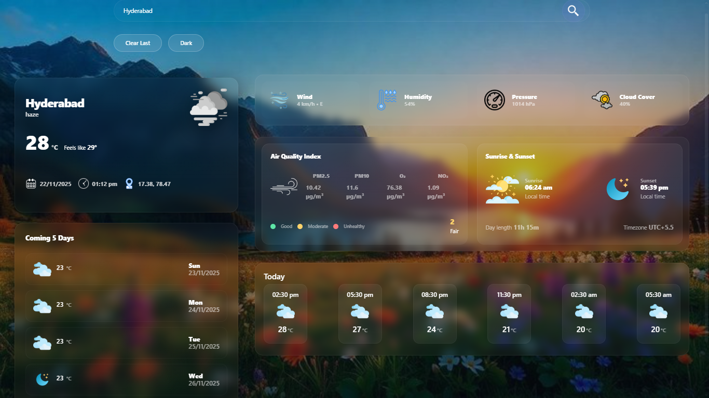
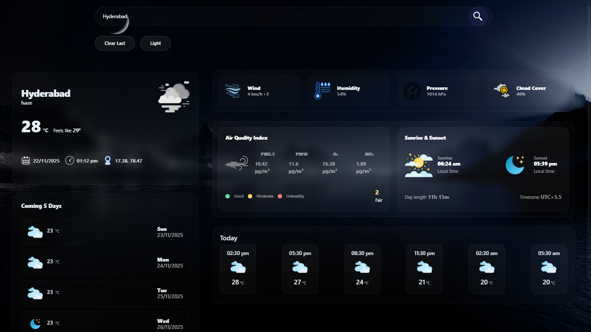
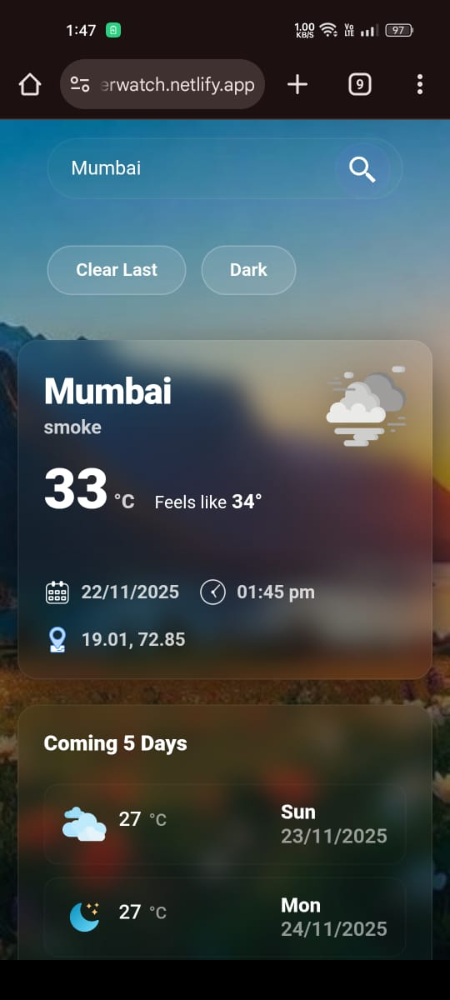
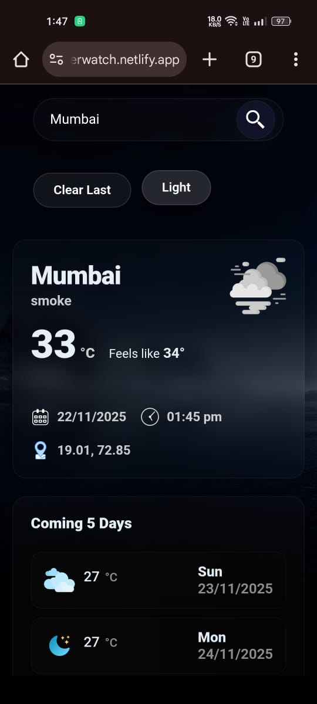

```markdown
# Weather Dashboard — LiveWeatherWatch

**Production-ready, accessible, and deployable single-page weather dashboard built with vanilla JS + Netlify Functions (OpenWeather proxy).**  
*Role: Full-stack frontend engineer — delivering pixel-perfect UI, resilient API proxy, caching, accessibility, and production deployment.*

---

## 📸 Screenshots

### Main Interface
A clean glassmorphism interface with real-time weather data, AQI metrics, hourly forecast, 5-day forecast, sunrise/sunset, geolocation fallback, and fully persistent dark mode.





---

## 🚀 Quick elevator pitch (what I would tell a hiring manager)

A polished, production-ready weather dashboard showcasing strong product sense and engineering fundamentals: a modern responsive UI, robust client logic (caching, fail-safes, offline-friendly behavior), secure serverless API proxying, accessibility-focused markup, and a clean CI/CD-friendly deployment pipeline.  
This repo demonstrates how I think about UX, reliability, observability, and secure API usage — exactly what large MNCs expect from mid-to-senior frontend engineers.

---

## 🔗 Live demo

**Production:** https://liveweatherwatch.netlify.app/

---

## 🛠️ Tech stack

- **Frontend:** HTML5, modern ES (vanilla JS), CSS variables + responsive breakpoints, Bootstrap utilities  
- **Serverless / Proxy:** Netlify Functions (Node 18) to securely wrap OpenWeather API  
- **Hosting / CI:** Netlify (publish directory: `src`, functions in `netlify/functions`)  
- **Engineering Tools:** Fetch with timeout, AbortController, runtime caching, image fallbacks, alt-text generation  
- **Testing / Observability:** strategies provided below (Jest, Playwright, Lighthouse)

---

## ✅ Key features & engineering highlights

- **Modern glass UI** — responsive grid layout, animated interactions, optimized contrast for accessibility  
- **Secure serverless API proxy** — prevents exposing `OPENWEATHER_KEY` in frontend  
- **Resilient client logic** — abortable fetches, timeouts, structured error toasts, defensive parsing  
- **Caching layer** — 5-minute forecast cache reduces API calls and improves UX  
- **Icon fallback engine** — auto-selects icons, resolves extension, and gracefully falls back  
- **Timezone-correct rendering** — accurate local timestamps using timezone offset  
- **AQI integration** — PM2.5, PM10, NO₂, O₃ + mapped AQI categories (Good → Very Poor)  
- **Realtime hourly forecast** — smart slicing of forecast list based on current UTC  
- **Dark mode** — persistent via localStorage, with dynamic background resolution  
- **Improved UX for slow/limited networks** — timeouts, abortable requests, safe fallback UI  
- **Security-first approach** — no secrets in client code; serverless function validation

---

## 📂 Project structure

```

.
├── README.md
├── screenshots/
│ ├── desktop-light.png
│ ├── desktop-dark.png
│ ├── mobile-light.jpeg
│ ├── mobile-dark.jpeg
│
├── src/
│ ├── index.html
│ ├── styles/
│ │ └── style.css
│ ├── js/
│ │ └── script.js
│ └── images/
│ └── (weather icons, backgrounds, misc assets)
│
├── netlify/
│ └── functions/
│ └── openweather.js
│
├── netlify.toml
└── package.json

````

> **Note:** Netlify publishes the `src/` directory and executes lambda functions inside `netlify/functions`.

---

## 🧪 Install & run locally (using Netlify dev)

> Because this project uses Netlify Functions, the best local workflow uses Netlify CLI.

### 1. Clone the repo
```bash
git clone <repo-url>
cd weather-dashboard
````

### 2. Install Netlify CLI

```bash
npm install -g netlify-cli
```

### 3. Add your API key

```bash
export OPENWEATHER_KEY="your_key_here"
# Windows (PowerShell)
# $env:OPENWEATHER_KEY="your_key_here"
```

### 4. Run locally

```bash
netlify dev
```

### 5. Visit

```
http://localhost:8888
```

---

## ⚙️ Deployment notes

* Required environment variable: **OPENWEATHER_KEY**
  (Set inside Netlify → Site Settings → Build & Deploy → Environment)

### `netlify.toml` (already configured)

```toml
[build]
  command = "npm run build"
  publish = "src"
  functions = "netlify/functions"
```

---

## 🔐 API proxy: design & security

The serverless proxy (`openweather.js`) ensures:

* API key never shipped to client
* Only allowed query parameters forwarded
* Unified error handling and status passthrough
* Safe extension point for rate limiting / logging

This is essential for enterprise-grade security and compliance.

---

## 🧩 Maintainability & architecture choices

* Modular logic:
  `updateCurrentWeather`, `updateFiveDayForecast`, `updateTodayHourly`
* Defensive coding: fallback text, safe DOM access, structured error toasts
* Caching: 5-min TTL for forecast results
* Accessibility:

  * keyboard input handling
  * alt text auto-generation
  * readable contrast in both light/dark modes
* Smooth animations wrapped in reusable helper (`animateEl`)

---

## 🧠 Product & UX reasoning (talking points for interviews)

* Secure serverless proxy rather than leaking API keys
* User-centered: handles slow connections, rate limits, invalid input gracefully
* Modular layout ready to expand (UV Index, radar map, pollen, etc.)
* Dark mode persistence — improving personalization
* Caching: better UX + lower API usage cost

---

## 🧪 Testing strategy (recommended)

* **Unit tests (Jest)**

  * `degToCompass`
  * `iconFilename`
  * `formatLocal`
  * `imageExists` (mocked)

* **Integration tests**

  * mock fetch to Netlify function
  * verify DOM updates for weather + forecast

* **E2E tests (Playwright)**

  * Search workflow
  * Geolocation fallback
  * Dark mode
  * AQI rendering

* **Lighthouse audit**

  * Performance
  * Accessibility
  * PWA (optional upgrade)

---

## 🧵 CI/CD (recommended)

* GitHub Actions:

  * ESLint
  * Prettier
  * Jest
  * Lighthouse CI (fail PRs below thresholds)
* Netlify deploy previews for every pull request
* Automated environment validation (OPENWEATHER_KEY existence)

---

## 📊 Observability & monitoring (enterprise-grade)

* Integrate Sentry/LogRocket
* Track client JS errors and slow network events
* Add structured logs to Netlify Functions
* API rate-limit monitoring to avoid quota exhaustion

---

## 🔒 Security checklist

* [x] API key never exposed in frontend
* [x] Serverless proxy with validation
* [ ] Add caching/rate-limiting to function (scale-ready)
* [ ] Sanitize user inputs at function level

---

## 🚢 Deploy checklist (for reviewers)

1. Set `OPENWEATHER_KEY` in Netlify
2. Confirm build publishes `src/`
3. Validate serverless function returns JSON
4. Run smoke test:

   * Search city
   * Geolocation
   * Forecast
   * AQI
   * Dark mode toggle

---

## 📝 Resume-ready blurb

> Built and deployed a production-ready weather visualization dashboard with secure serverless API proxying, robust client-side caching, dark mode, real-time AQI integration, and a responsive glass-UI. Demonstrates full-stack frontend engineering, clean architecture, reliability mechanisms, and deployment on Netlify.

---

## 🔍 Files for reviewers

* `src/index.html` — markup + accessibility
* `src/styles/style.css` — design system and layout
* `src/js/script.js` — core logic, caching, API flows
* `netlify/functions/openweather.js` — secure API proxy layer
* `netlify.toml` — deployment configuration

---

## 🧩 Minimal `.env` example

```
# DO NOT COMMIT THIS FILE
OPENWEATHER_KEY=sk_live_your_key_here
```
